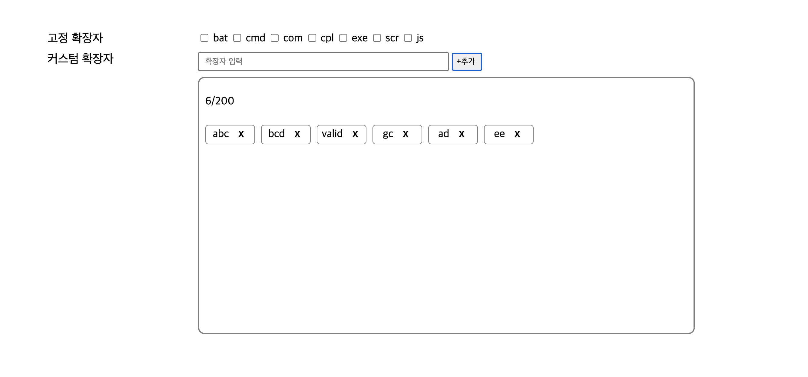

# 파일 차단 확장자 등록 페이지 작성
## 목표
서버에 들어가서는 안되는 확장자 등록 페이지 작성

## 화면


## 조건
  1. 고정 확장자는 차단을 자주하는 확장자를 리스트이며, default는 unCheck. 
  2. 고정 확장자를 check or uncheck를 할 경우 db에 저장.
  3. 확장자 최대 입력 길이는 20자리.
  4. 추가버튼 클릭시 db 저장되며, 아래쪽 영역에 표현.
  5. 커스텀 확장자는 최대 200개까지 추가가 가능 .
  6. 확장자 옆 X를 클릭시 db에서 삭제.
  
## 추가 조건
  1. 커스텀 확장자 추가 등록시
      1. 중복된 커스텀 확장자 등록 x
      2. 이름이 빈칸이면 등록 x
      3. Null 등록 x
      4. 이름은 1자 이상 20자 이하로 범위 설정
    
  2. 확장자 변경 시 고려사항
      1. 변경하고자 하는 확장자가 없을 시 변경 x
    
  3. 커스텀 확장자 삭제 시 고려사항
      1. 삭제하고자 하는 확장자가 없을 시 삭제 x
    
  4. 단위 유닛 테스트 실시하기
  5. 초기 고정 확장자 데이터는 sql문으로 집어 넣기
## Mysql 사용 테이블
```sql
  CREATE TABLE `extension` (
  `extension_id` bigint NOT NULL AUTO_INCREMENT,
  `block` bit(1) NOT NULL,
  `name` varchar(20) NOT NULL,
  `type` int NOT NULL,
  PRIMARY KEY (`extension_id`),
  UNIQUE KEY `UK_gmfbyygelvk6j16w8p3h54a9m` (`name`)
) 
```

## 초기 고정 확장자 삽입 SQL문
```sql
  insert into extension( name, block, type) values("bat", false, 1);
  insert into extension(name, block, type) values("cmd", false, 1);
  insert into extension(name, block, type) values("com", false, 1);
  insert into extension(name, block, type) values("cpl", false, 1);
  insert into extension(name, block, type) values("exe", false, 1);
  insert into extension(name, block, type) values("scr", false, 1);
  insert into extension(name, block, type) values("js", false, 1);
```

## 사용한 중요 라이브러리 및 프레임 워크
- spring boot 2.6.1
- jpa/hibernate
- Mysql 8
